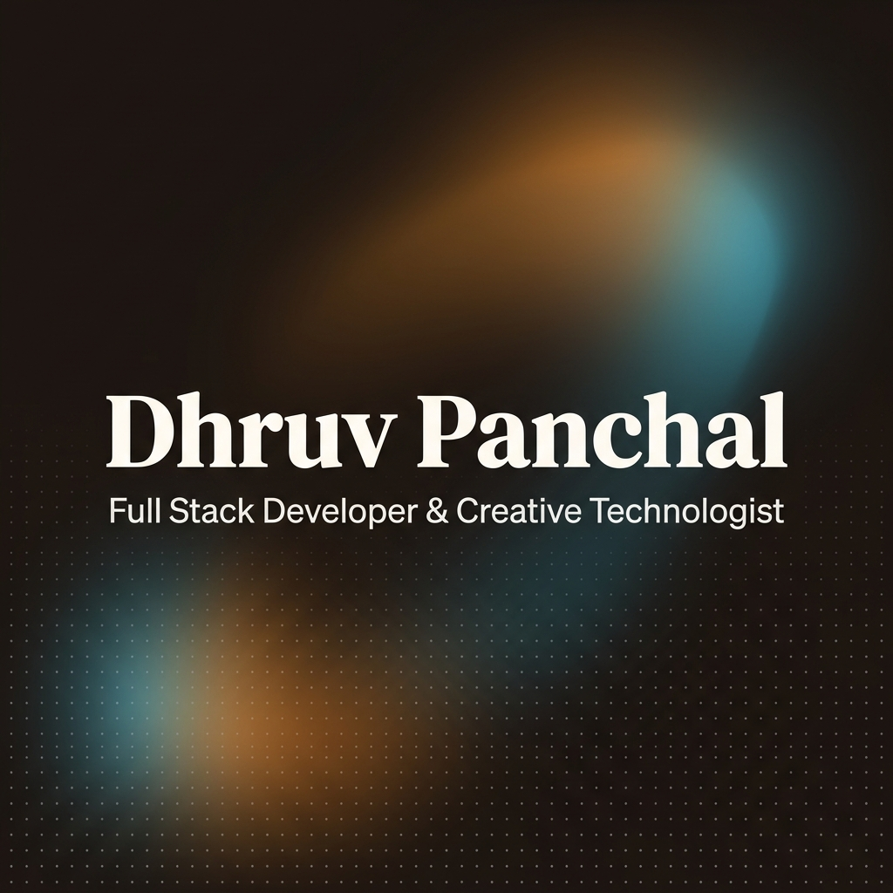

# 🚀 Dhruv Panchal — Portfolio OS

> A modern, CMS-powered portfolio built for engineers, creators, recruiters, and collaborators. Designed to showcase projects, experience, research, visual storytelling, and digital craftsmanship through a fully manageable content platform.



---

## 🌐 Live Website

**Portfolio:** `https://your-domain.com`

---

## ✨ Overview

This portfolio is more than a personal website.

It functions as a complete **Personal Branding Operating System** that combines:

* Professional portfolio
* Project showcase
* Case study platform
* Resume hub
* Content management system
* Guestbook
* Research & experimentation archive
* Creative work showcase

Every major section is managed through a dedicated Admin CMS powered by Supabase, eliminating the need for direct code changes when updating content.

---

## 🎯 Why This Project Exists

Traditional portfolio websites quickly become outdated because every update requires editing code.

The goal of this project was to create a portfolio that:

* Scales with career growth
* Supports continuous content updates
* Provides a premium user experience
* Enables recruiter-friendly navigation
* Showcases technical and creative abilities equally
* Acts as a living digital identity

---

## 🧩 Core Features

### 👤 Profile Management

* Dynamic profile information
* Editable biography
* Availability status
* Open-to-work indicators
* Location management
* Profile image management

---

### 📄 Resume CMS

Manage everything directly from Admin Panel:

* Resume PDF uploads
* Experience
* Education
* Skills
* Certifications
* Achievements
* Custom sections
* Reordering support

No code changes required.

---

### 💼 Projects CMS

Complete CRUD functionality:

* Create projects
* Edit projects
* Delete projects
* Publish / Draft states
* Featured projects
* Categories
* GitHub links
* Live links
* Technology stack
* Cover images
* Gallery images

---

### 📚 Dynamic Case Studies

Each project supports advanced case studies:

#### Core Sections

* Overview
* Problem Statement
* Goals
* Solution
* Tech Stack
* Key Features
* Results
* Metrics

#### Advanced Sections

* Design Process
* Architecture
* Research
* Challenges
* Learnings
* Timeline
* Future Scope
* Custom Sections

Everything is CMS-managed.

---

### 📝 Blog CMS

* Create posts
* Draft system
* Publish workflow
* Featured articles
* Cover images
* SEO metadata
* Slug management

---

### 💬 Testimonials CMS

Manage:

* Testimonials
* Author details
* Roles
* Skills
* Featured testimonials
* Display controls

---

### 📮 Guestbook

Visitors can:

* Authenticate via GitHub
* Authenticate via Google
* Leave messages
* Interact with the portfolio

---

### 📬 Contact & Feedback System

Built-in submission management:

* Contact forms
* Feedback forms
* Admin dashboard visibility
* Submission tracking

---

### ⚡ Command Menu

Global command palette:

```bash
Ctrl + K
```

Quick access to:

* Pages
* Projects
* External links
* Resources
* Social profiles

Fully CMS-managed.

---

### 🎨 Theme System

Customizable interface featuring:

* Dark-first design
* Accent color support
* Smooth transitions
* Motion effects
* Responsive layouts

---

### 🛠 Engine Room

A dedicated section showcasing:

* Development tools
* Hardware
* Software
* Creative workflow
* Production setup

Fully manageable from the CMS.

---

## 🏗 Architecture

```text
Portfolio
│
├── Public Website
│   ├── Home
│   ├── About
│   ├── Work
│   ├── Resume
│   ├── Blog
│   ├── Testimonials
│   ├── Guestbook
│   ├── Engine Room
│   └── Contact
│
├── Admin Dashboard
│   ├── Projects CMS
│   ├── Blog CMS
│   ├── Testimonials CMS
│   ├── Resume CMS
│   ├── Profile CMS
│   ├── Social Links CMS
│   ├── Command Menu CMS
│   ├── Engine Room CMS
│   └── Portfolio Settings
│
└── Supabase Backend
    ├── Database
    ├── Authentication
    ├── Storage
    └── Realtime Services
```

---

## ⚙️ Tech Stack

### Frontend

* Next.js 13
* React
* TypeScript
* Tailwind CSS
* Framer Motion
* Shadcn/UI

### Backend

* Supabase
* PostgreSQL
* Row Level Security (RLS)

### Authentication

* Google OAuth
* GitHub OAuth
* Email Authentication

### Storage

* Supabase Storage

### Deployment

* Vercel

---

## 📊 Performance Targets

| Metric         | Score |
| -------------- | ----- |
| Performance    | 90+   |
| Accessibility  | 95+   |
| Best Practices | 100   |
| SEO            | 100   |

---

## 🔒 Security

* Supabase RLS Policies
* Protected Admin Routes
* OAuth Authentication
* Secure Environment Variables
* Storage Access Controls

---

## 📱 Responsive Design

Optimized for:

* Desktop
* Laptop
* Tablet
* Mobile Devices

---

## 🎬 Beyond Development

This portfolio reflects my broader interests beyond software engineering.

### Areas I Explore

* Artificial Intelligence
* Full-Stack Development
* UI/UX Design
* Visual Storytelling
* Content Creation
* Video Production
* Digital Branding
* Product Thinking

---

## 🚀 Local Development

### Clone Repository

```bash
git clone https://github.com/yourusername/portfolio.git
```

### Install Dependencies

```bash
npm install
```

### Configure Environment

```env
NEXT_PUBLIC_SUPABASE_URL=
NEXT_PUBLIC_SUPABASE_ANON_KEY=
```

### Run Development Server

```bash
npm run dev
```

### Production Build

```bash
npm run build
npm start
```

---

## 📈 Future Roadmap

* AI-powered content assistant
* Analytics dashboard
* Newsletter platform
* Reading list integration
* Spotify integration
* Project timeline visualization
* Research publication hub
* Public API

---

## 👨‍💻 About Me

I'm **Dhruv Panchal** — a Computer Science student and creative technologist passionate about building at the intersection of technology, design, and storytelling.

From scalable web applications and AI-powered solutions to visual content and digital experiences, I enjoy transforming ideas into products that are both meaningful and memorable.

---

## 🤝 Connect

* Portfolio → `https://your-domain.com`
* LinkedIn → `https://linkedin.com/in/your-profile`
* GitHub → `https://github.com/DhruvPanchal23`
* Email → `dhruvpanchal.dev@gmail.com`

---

<div align="center">

### Built with curiosity, creativity, and more cans of Monster than I'd like to admit ⚡

**© Dhruv Panchal**

</div>
